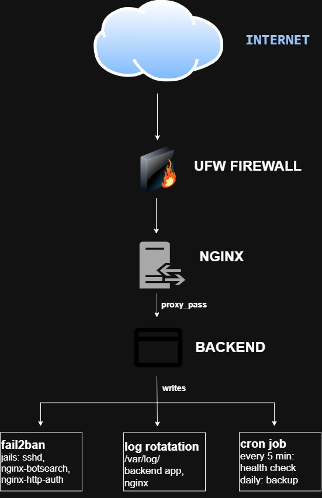

# Linux Multi-Service Automation

An automation script that provisions a Flask backend behind an Nginx
reverse proxy, with UFW, fail2ban, log rotation and systemd services

## Architecture



The backend listens on `127.0.0.1:3000`.
- **Target OS:** Ubuntu 22.04 / 24.04 (Debian-based, `apt`)
- **Entry script:** `sudo ./provision.sh` (one command provisions everything)
- **Log:** every run is timestamped to `/var/log/provision.log`

## Repository layout

```
.
├── provision.sh                    # orchestrator — the only script you run directly
├── scripts/
│   ├── config.sh                   # shared logging/validation helpers (sourced by all)
│   ├── system-setup.sh             # apt update + base packages + DNS check
│   ├── create-user.sh              # non-root service user (appsvc)
│   ├── install-backend.sh          # Python venv + Flask app deployment
│   ├── configure-nginx.sh          # reverse proxy (plain HTTP)
│   ├── configure-tls.sh            # bonus: self-signed HTTPS + HTTP redirect
│   ├── configure-firewall.sh       # UFW rules
│   ├── configure-fail2ban.sh       # SSH + Nginx jails
│   ├── configure-logrotate.sh      # log directory + rotation policy
│   ├── configure-monitoring.sh     # bonus: health-check cron
│   ├── configure-backup.sh         # bonus: backup cron
│   └── verify.sh                   # post-run verification checks
├── app/
│   ├── app.py                      # Flask backend
│   └── requirements.txt
├── systemd/backend.service
├── nginx/
│   ├── upstream.conf                # upstream backend_app 
│   ├── backend.conf                 # port 80, direct proxy 
│   ├── backend-redirect.conf        # port 80, 301 → https 
│   └── backend-tls.conf             # port 443, proxy + TLS 
├── fail2ban/jail.local
├── logrotate/backend-app
├── monitoring/health-check.sh
├── backup/backup.sh
└── README.md
```

## How to run it

```bash
git clone <your-repo-url> && cd linux-multi-service-automation

# Basic run (HTTP only)
sudo ./provision.sh

# With TLS (self-signed cert on :443, HTTP→HTTPS redirect)
sudo ./provision.sh --with-tls --domain myapp.local

# Skip the cron jobs if you don't want them
sudo ./provision.sh --skip-monitoring --skip-backup
```

### Verify the script works

```bash
curl http://localhost/                       
curl http://localhost/health
sudo systemctl status backend-app nginx fail2ban
sudo ufw status verbose
```

## Design decisions

| Decision | Why |
|---|---|
| UFW only opens 443 if `--with-tls` was passed | This was done so the firewall never has an open port for a feature that isn't actually running. `configure-firewall.sh` checks `if [[ "${ENABLE_TLS:-false}" == "true" ]]` before adding `ufw allow 443/tcp` if TLS was never enabled, that line just never executes and 443 stays closed. |
| Nginx config is split into four files (`upstream.conf`, `backend.conf`, `backend-redirect.conf`, `backend-tls.conf`) | This was done so switching TLS on or off means swapping which files are linked, not editing conditionals into one shared config. `upstream.conf` stays symlinked in `sites-enabled` at all times since both the plain and TLS vhosts `proxy_pass http://backend_app;` against it. `configure-tls.sh` then does `rm -f /etc/nginx/sites-enabled/backend.conf` and links `backend-redirect.conf` + `backend-tls.conf` in its place, so at any point, whichever files are actually symlinked tell you exactly what state Nginx is running in. |
| HTTP redirects to HTTPS instead of both running side by side | This was done so enabling TLS actually stops plaintext traffic from being served, instead of just adding an HTTPS option next to it. `backend-redirect.conf` replaces `backend.conf` on port 80 with a single `return 301 https://$host$request_uri;` port 80 no longer proxies to the app at all, it only redirects the request over to 443. |
| Certificate is self-signed, generated with openssl | This was done so Nginx could actually terminate HTTPS and route to the app over TLS instead of just plain HTTP — without a real cert, port 443 has nothing to present and TLS can't work at all. One `openssl req -x509` command creates the cert and key together (`-newkey rsa:2048`), skips the CA signing step since it's self-signed, and leaves the key unencrypted (`-nodes`) so Nginx can read it and start up without needing a passphrase typed in. Valid for a year (`-days 365`), named non-interactively (`-subj "/CN=${DOMAIN}"`) so it fits, and the key gets `chmod 600` right after so only root can read it. |
| The Backend only listens on `127.0.0.1:3000` | This was done so Nginx is the only path into the app — nothing else on the box or the network can reach port 3000 directly. `app.run(host="127.0.0.1", port=3000)` binds strictly to loopback, and because of that, `configure-firewall.sh` never needs a UFW rule for 3000 at all — the port is unreachable from outside the host regardless of firewall state. |
| The Python application runs through Gunicorn | This was done so the app can actually handle more than one request at a time. The dev server is single-threaded and blocks on each request; `backend.service` instead runs `gunicorn --workers 2 --bind 127.0.0.1:3000 app:app`, so two worker processes can serve requests in parallel behind Nginx. |
| The Backed app runs as its own user, `appsvc`| This was done so the app does not have more access than it needs and can't be used to get a foothold on the box. `useradd --system` creates it as a service account with no password, and `--shell /usr/sbin/nologin` means even a leaked credential can't be used to open an interactive session as that user. |
| systemd unit is locked down (`NoNewPrivileges`, `ProtectSystem=strict`, `ProtectHome`, explicit `ReadWritePaths`) | This was done so a compromised app process still can't touch the rest of the filesystem. `ProtectSystem=strict` which makes the entire filesystem read-only to the service by default, and `ReadWritePaths=/opt/backend-app /var/log/myapp` is the one explicit exception, those are the only two directories it can write to, everything else stays off-limits regardless of what the app tries to do. |
| fail2ban is set to `backend = systemd` | This was done so the sshd jail actually has something to read. Ubuntu logs SSH auth attempts to the journal, not a flat file, by default without `backend = systemd` in `jail.local`, fail2ban would be watching a log path that never gets written to, and the sshd jail would just never trigger. |
| Logrotate has three separate blocks instead of one | This was done so each log gets rotated on a schedule that actually matches how often it's written to. The app and Nginx logs are written continuously, so they rotate `daily`; the health-check and backup logs only get one line every 5 minutes or once a day, so they rotate `weekly` and putting them on a daily schedule too would just produce a stack of nearly-empty archives. |
| Logrotate restarts the backend service instead of sending it SIGHUP | This was done because sending SIGHUP wouldn't actually do anything here. Python's `logging.basicConfig` opens the log file once and holds that file handle open, with no signal handler to make it reopen the file after rotation, so the `postrotate` block runs `systemctl reload-or-restart backend-app.service` instead, which is what actually gets the app writing to the fresh file. |
| Backup script checks the archive before trusting it | This was done so a broken backup doesn't sit there looking fine until the day it's actually needed. Right after `tar -czf` creates the archive, the script runs `tar -tzf` on it to confirm it's readable, and deletes it if that check fails a file that exists on disk isn't the same as one that will actually restore. |
| Every script under `scripts/` runs on its own | This was done so any one piece of the setup can be tested or rerun without any of the others failing with it. Each script checks `if [[ "${BASH_SOURCE[0]}" == "${0}" ]]` before running its function, so it only executes automatically when called directly `provision.sh` sources every script and calls the functions itself, in order, but nothing stops you from running `sudo ./scripts/configure-nginx.sh` on its own to debug just that piece. |
